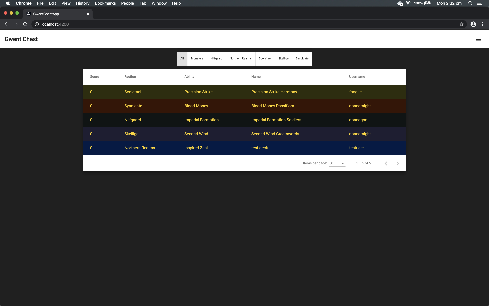

# Gwent-Chest

A web application for creating and cataloging [Gwent](https://www.playgwent.com/en "Official Gwent webpage") decks.

##### Table of Contents

- [Video](#video)
- [Features](#features)
  - [Completed](#completed)
  - [To-Do](#to-do)
- [Frameworks and Technologies](#frameworks-and-technologies)
  - [Frameworks](#frameworks)
  - [Database](#database)
  - [Other Libraries and Technologies](#other-libraries-and-technologies)

## Video

## Features

### Completed

#### Deckbuilder

- The Deckbuilder allows users to build and save valid Gwent decks.
  - A valid Gwent deck consists of:
    - 1 Leader Ability
    - 1 Stratagem
    - At least 25 cards (with at least 13 of those cards being Units)
    - A maximum of 1 copy of a unique gold card.
    - A maximum of 2 copies of a unique bronze card.
    - Be under the provision limit (150 + provision boost from Leader Ability)
  - In order to save the deck, the user must be logged-in.
  - If the user does not name the deck before saving, a default name will be used (i.e. the name of the selected Leader Ability).
- Cards can be filtered by:
  - Faction (All, Neutral, selected Faction)
  - Type (All, Unit, Special, Artifact)
  - Colour (All, Gold, Bronze)
- Cards can be removed from the deck by clicking on the card in the deck.
- When a card is hovered over, a tooltip provides vital information about the card.

#### Catalogue

- The Deck Catalogue displays a list of all Gwent decks saved to the database.
- Decks can be sorted by:
  - Score
  - Faction
  - Leader Ability
  - Deck Name
  - Username of deck creator
- Client-side pagination for 24, 50 (default), 100, or 250 decks per page.
- Filter decks visible in data table by faction - WIP
- Clicking on a deck in the catalogue takes the user to the Deck page, where the user can:
  - View the deck and its constituent cards (with the help of tooltips).
  - Upvote or downvote the deck - WIP
  - If the user owns the deck, add a description or guide for the deck - WIP

### To-Do

- Add upvote/downvote functionality for decks.
- Add ability for user's to add descriptions to their own decks.
- Get faction filter on deck catalogue page working.
- Add user profile page.
  - Allow users' to change their details.
  - Allow all users to view a list of a user's submitted decks.

## Frameworks and Technologies

### Frameworks

- Angular - Frontend JavaScript Framework
- Node.js - JavaScript Runtime Environment
- Express.js - Node.js Web Framework

### Database

- MongoDB - Database

### Other Libraries and Technologies

- JSON Web Tokens - Authentication / Access
- Bcrypt - Hashing / Salting
- Mongoose - Object Data Modeling (ODM) library for MongoDB
- Joi - Schema Description and Data Validation
